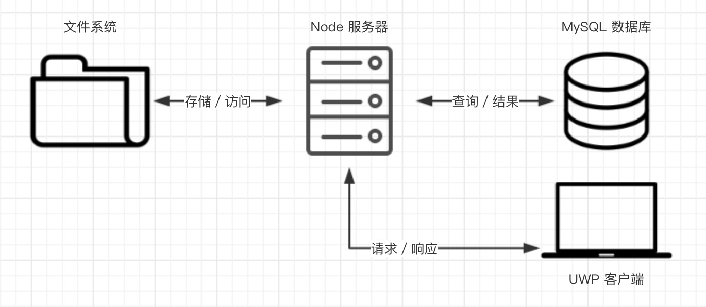
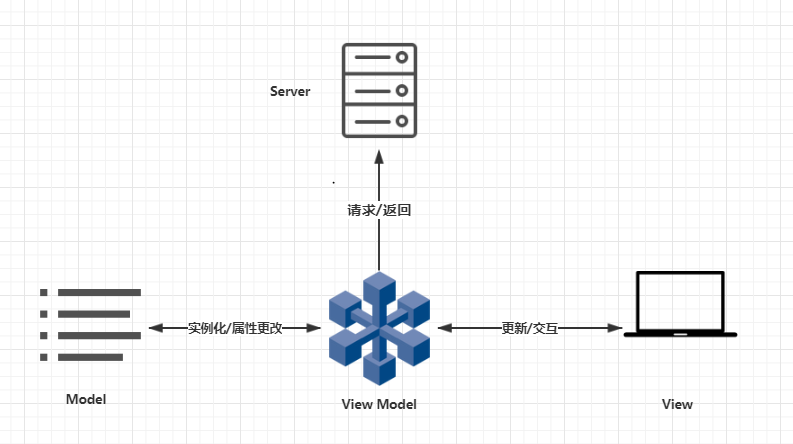
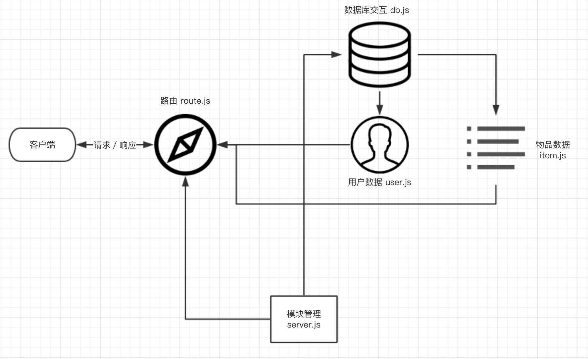

<h1><center>现代操作系统 期中项目 实验报告</center></h1>

<h2><center>iSharing</center></h2>

<center></img></center>

<center>
<h3>开发人员</h3>

**徐伟元 16340261**
**许倚安 16340265**
**熊永琦 16340258**
</center>

<h3>目录</h3>

<!-- TOC -->

- [项目概述](#项目概述)
- [项目运行](#项目运行)
- [为什么使用 UWP](#为什么使用-uwp)
- [为什么需要服务端？](#为什么需要服务端)
- [项目架构](#项目架构)
- [项目设计](#项目设计)
- [项目分工](#项目分工)
- [开发过程](#开发过程)
- [前端开发细节](#前端开发细节)
  - [前端细节架构](#前端细节架构)
    - [登陆注册](#登陆注册)
    - [个人信息](#个人信息)
    - [物品页面](#物品页面)
    - [UI](#ui)
    - [主页面逻辑](#主页面逻辑)
  - [代码 Review](#代码-review)
- [服务端开发细节](#服务端开发细节)
  - [服务端细节架构](#服务端细节架构)
    - [模块管理 server.js](#模块管理-serverjs)
    - [路由 route.js](#路由-routejs)
    - [数据库交互 db.js](#数据库交互-dbjs)
    - [数据管理模块 User.js & Item.js](#数据管理模块-userjs--itemjs)
  - [效率优化](#效率优化)
    - [图片存取](#图片存取)
    - [池化连接](#池化连接)
    - [懒惰加载](#懒惰加载)
- [覆盖知识点](#覆盖知识点)
- [视频展示流程](#视频展示流程)
- [后记/感想](#后记感想)

<!-- /TOC -->

<div STYLE="page-break-after: always;"></div>

### 项目概述

共享物品日益火爆，市场前景诱人。我们可以开发提供物件的租赁服务平台，来迎合这种弹性需求。

iSharing 平台提供用户注册，浏览可租物品，发布租赁物品，管理个人物品，修改个人信息功能。租赁物品需要用户通过平台提供的物品提供方信息自行联系。

项目为 Windows 10 的 UWP 应用，总体分为 FrontEnd 和 ServerEnd 两个部分。对于项目技术栈，FrontEnd 使用 XAML 设计页面和 C# 处理业务逻辑；ServerEnd 使用 Node 搭建本地服务器，数据库使用 Mysql 并挂载在服务端。交互逻辑为，FrontEnd 的 UI 交互发生后，后台处理代码向本地服务器 post request，本地服务器给出 response，后台处理 response 后，显示在 UI 页面。

UI 页面包括登陆/注册页面，浏览主页面，物品详情页面，个人信息页面，发布租赁物品页面，个人物品管理页面。

项目源代码均已开源放在 [github](https://github.com/xwy27/iSharing)。

### 项目运行

见文件目录下 README.md。

### 为什么使用 UWP

1. Windows 10 是当前大多数用户使用的操作系统，在全球范围内，其市场占有率在 50% 以上。基于面向大多数用户的项目初期开发目标，选择 windows 10 下的 APP 是有前景的。
1. UWP(Universal Windows Platform) 作为 Microsoft 在 Windows 10 上推出的新应用平台。其潜在市场不言而喻。
1. UWP 会根据不同的设备类型使用相应的自适应 UI 控件，并使用运行 Windows 10 Insider Preview 的所有设备上必须具有的通用 API 集。即，UWP 就是通用应用，可以在电脑端，手机端，或其他设备通用。不用分别为不同的平台设计不同的软件。

### 为什么需要服务端？

1. 作为一个面向大众，基于用户间交互的服务型项目，iSharing 需要网络服务的支持来实现交互的功能。
1. 因为创新的功能和独特的需求，我们难以找到一个现成的 API。
1. 由于应用的需要，我们需要一个中央数据库用于存储用户信息。
1. 服务端在支持电脑端 UWP 应用的同时，也是我们能够方便的将应用拓展诸如网页端和手机端的更多元平台。

### 项目架构

本项目的设计遵从 MVC 设计模式。我们在架构设计中，尽可能地分离了 Model(数据库)、View(UWP客户端)和 Controller(Node 服务器)。一个完整的客户端／服务端交互的流程如下：



1. UWP 客户端通过 API 向 Node 服务端发出请求
1. Node 客户端向 MySQL 数据库发出查询请求
1. MySQL 返回查询结果
1. Node 服务器向 UWP 客户端返回结果

### 项目设计

1. 登陆/注册页面
    - Username
    - Password(encode)
    - E-mail
    - Tel
    - 扣扣/微信
1. 页面(Navigation view)
    - 浏览页面
        - 物品图片
        - 物品名称
        - 租赁价格
    - 物品详情
        - 物品名称 & 价格
        - 物品图片
        - 物品描述
        - 房东信息
    - 发布页面
        - 物品名称
        - 物品价格
        - 物品图片
        - 物品描述
    - 个人信息
        - 头像
        - Username
        - Password(encode)
        - E-mail
        - Tel
        - 扣扣/微信
    - 物品管理
        - 物品图片
        - 物品名称
        - 租赁价格
1. Database
    - 用户表单
        - 头像(url) maxlength: 60000+
        - Username(string unique) maxlength: 30
        - Password(string) maxlength: 60
        - E-mail(string) maxlength: 50
        - Tel(string) maxlength: 11
        - qq(string) maxlength: 20
        - wechat(string) maxlength: 30
    - 物品表单
        - userId(int, foreignkey)
        - ItemId(int, primarykey)
        - 物品名称(string)
        - 物品价格(float)
        - 物品描述(string)
        - 物品图片(string)

### 项目分工

- 徐伟元(**前端 + 全栈 diss**)
    - 登陆注册
    - 个人信息
    - 主页面逻辑
    - 全栈 review
  <div STYLE="page-break-after: always;"></div>

- 许倚安(**前端 + 美工小姐姐**)
    - 物品浏览
    - 物品发布
    - 物品管理
    - UI 设计
- 熊永琦(**后端 + 测试工程师**)
    - Node server
    - 数据库

### 开发过程

项目开发采用迭代开发

- **骨鲲**迭代(5.07-5.13)
  - Frontend
    - 登陆注册
    - 个人信息修改
    - 信息合法性校验
    - 主页面框架
  - Server
    - 服务端架设
    - 图片存取优化
- **尸鲲**迭代
  - Frontend(5.13-5.27)
    - 密码加密
    - 浏览物品
    - 发布物品
    - 修改物品
    - UI 设计
    - logo 设计
  - Server
    - 池化连接
    - 懒惰加载

### 前端开发细节

#### 前端细节架构



<div STYLE="page-break-after: always;"></div>

##### 登陆注册

1. 采用类似面包屑的思想，在同一页面中，初始显示登陆 UI，在点击按钮时，在二者间进行切换，避免多文件的困扰。
    ```cs
    /**
      * 转到登陆页面
      */
    private void ToLogin(object sender, RoutedEventArgs e) {
      Rest();
      SignupPage.Visibility = Visibility.Collapsed;
      LoginPage.Visibility = Visibility.Visible;
    }

    /**
      * 转到注册页面
      */
    private void ToSignUp(object sender, RoutedEventArgs e) {
      Rest();
      SignupPage.Visibility = Visibility.Visible;
      LoginPage.Visibility = Visibility.Collapsed;
    }
    ```
1. 前端先进行信息合法校验
1. 考虑到安全性，在发送数据到服务器前，对密码进行加密处理。
    ```cs
    password = Post.EncodePsd(password);

    /**
     * 加密 password 函数
     * @param {string} input 需加密信息
     * @return {string} 加密后的 16 进制串
     */
    public static string EncodePsd(string input) {
      var alg = HashAlgorithmProvider.OpenAlgorithm(HashAlgorithmNames.Md5);
      buff = CryptographicBuffer.ConvertStringToBinary(input, BinaryStringEncoding.Utf8);
      var hashed = alg.HashData(buff);
      return CryptographicBuffer.EncodeToHexString(hashed);
    }
    ```
1. 为减轻服务器压力，注册时不提供头像选择功能，改在个人信息页面提供。因为很多人其实很少使用头像功能，所以可以直接使用本地图像作为默认头像，而不用每一次都向服务器请求头像。

##### 个人信息

1. 页面初始化阶段，从服务器请求数据，页面显示数据。
1. 用户信息更新前先行进行信息合法校验。
1. 个人头像的维护
    - 如果没有选择新头像，则不发送头像有关数据到服务器
    - 选择新头像，则发送新头像数据到服务器
    ```cs
    // post photo
    StorageFile theFile = null;
    if (ApplicationData.Current.LocalSettings.Values.ContainsKey("MyToken")) {
      if ((string)ApplicationData.Current.LocalSettings.Values["MyToken"] != "") {
        theFile = await StorageApplicationPermissions.FutureAccessList.GetFileAsync(
          (string)ApplicationData.Current.LocalSettings.Values["MyToken"]);
        ApplicationData.Current.LocalSettings.Values.Remove("MyToken");
      }
    }
    //选择新头像，发送到服务器
    if (theFile != null) {
      var photoResult = await Post.PostPhoto(theFile);
      // Pharse the json data
      JObject photoData = JObject.Parse(photoResult);
      var msg = (photoData["status"].ToString() == "success") ? "上传成功\n" : "上传失败\n";
      viewModel.CurrentUser.PhotoUrl = photoData["url"].ToString();
    }
    ```

##### 物品页面

1. 数据结构
    - 图片存储使用BitmapImage，与User不一样是因为物品以列表模式查看，需要一次加载很多张图片

<div STYLE="page-break-after: always;"></div>

2. ViewModel
    - 与User一样使用单例模式
    - 使用ObservableCollection发起更新事件
      ```cs
      public ObservableCollection<Item> Items {
            get { return observableItemCollection; }
      }
      ```
3. View-ViewItem
    - 列表制作方法同Homework1，列表绑定ViewModel中的ObservableCollection
    - 在列表点击时单项时更改SelectIndex获取指定物品
    - 跳转至该页面时通过跳转提供的参数判断列表显示内容，初始化变量Mode
      ```cs
      //如果是个人页面，将以获取个人发布物品方式开启
      if ((String)e.Parameter == "my") {
          mode = true;
      }
      ```
    - 设置变量Mode判断列表内容是个人发布的物品还是所有物品、点击时是修改页面还是详情页面，实现区别为POST到服务器的JsonString不一样
    - 分页从服务器获取物品，每页20个物品，通过当前ViewModel中已存有的物品数量判断页数
      ```cs
      int count = itemViewModel.Items.Count;
      if (count % 20 == 0) {
        if (mode) {
          await getOnesPage((itemViewModel.Items.Count / 20 + 1));
        } else {
          await getPage((itemViewModel.Items.Count / 20 + 1));
        }
      }
      ```
    - 图片详情页设置为同Page的另一个Grid，模式为所有物品时点击列表中单项打开
      ```cs
      ItemDetail.Visibility = Visibility.Visible;
      Exit.Visibility = Visibility.Visible;
      ItemList.Visibility = Visibility.Collapsed;
      ```
    - 模式为个人物品时点击列表中单项跳转至EditItem页面
4. View-EditItem
    1. 跳转至该页面时通过跳转提供的参数判断输入框与图片的初始内容，如果是新开页面则为添加物品页面，否则为编辑物品页面
    2. 上传图片时BitmapImage与Stream之间的转换，使用fileToken获取选取的图片或者默认图片
        ```cs
        string fileToken = (string)ApplicationData.Current.LocalSettings.Values["ItemPic"];
        ```
    3. 给价格输入框增加TextChanged事件处理器，不允许非数字输入
        ```cs
        Regex number = new Regex("[^0-9]");
        string after = Price.Text.ToString();
        after = number.Replace(after, "");
        Price.Text = after;
        ```

##### UI

1. 仿照 CSS，这次 UI 整体使用 Style 调整，将组件分类，如TextBlock 分为 Title\Info\InfoSec 几类，分别用于不同情况下的文本显示
2. User头像使用圆形头像，并给其上层的Button增加动画使其让人意识到可以点击
    ```xml
      <Ellipse Grid.Row="2" Width="80" Height="80" Margin="10" VerticalAlignment="Center" HorizontalAlignment="Center">
      <Ellipse.Fill>
        <ImageBrush x:Name="photo" ImageSource="../Assets/logo.jpg" />
      </Ellipse.Fill>
    </Ellipse>
    ```
3. Item图片使用与 2 中一样的方法，不用圆形，但增加 "+" 的符号让人意识到这个图片可以修改
    ```cs
    <VisualState x:Name="PointerOver">
      <Storyboard>
        <ObjectAnimationUsingKeyFrames Storyboard.TargetName="rootGrid" Storyboard.TargetProperty="Opacity">
          <DiscreteObjectKeyFrame KeyTime="0" Value="50"/>
        </ObjectAnimationUsingKeyFrames>
      </Storyboard>
    </VisualState>
    ```

<div STYLE="page-break-after: always;"></div>

##### 主页面逻辑

1. 采用 NavigationView 视图，将所有页面放在左侧导航栏中，提高用户体验。
1. 透明化标题栏，实现沉浸式 UI。
    ```cs
    //标题栏透明化
    CoreApplication.GetCurrentView().TitleBar.ExtendViewIntoTitleBar = true;
    ApplicationView.GetForCurrentView().TitleBar.ButtonBackgroundColor = Colors.White;
    ApplicationView.GetForCurrentView().TitleBar.ButtonBackgroundColor = Color.FromArgb(0, 0, 0, 0);
    ```
1. 将回退按钮变为登出按钮，实现登出功能，同时加入登出确认按钮，避免无意识操作导致登出。通过 dialog 增加 command 实现。
    ```cs
    private async void BackRequested(object sender, BackRequestedEventArgs e) {
      Frame rootFrame = Window.Current.Content as Frame;
      if (rootFrame == null) return;

      //Navigate back if possible, and if the event has not already been handled .
      if (!e.Handled && rootFrame.CanGoBack) {
        //只有主页面有回退可能，作为登出功能设计
        MessageDialog dialog = new MessageDialog("确认退出当前账号？", "登出");
        dialog.Commands.Add(new UICommand("确定", cmd => { }, "退出"));
        dialog.Commands.Add(new UICommand("取消", cmd => { }));
        IUICommand result = await dialog.ShowAsync();
        if (result.Id as string == "退出") {
          e.Handled = true;
          rootFrame.GoBack();
        }
      }
    }
    ```

#### 代码 Review

由于前端为两个人开发，所以有很多代码重复，，这是不利于维护且代码易读性很低。所以，进行前端代码的 review，将所有重复代码提取，并进行优化。

1. **if-else** 代码重叠
  if-else 出现重复处理逻辑，如 if 条件下更新 token，else 条件下更新不同 token，但赋值代码可以在 if-else 块外进行。将重复代码块合并去除。
1. **发送数据**到服务器代码重复
  向服务器发送数据，只是 url 和 json 数据不同，但 httpclient 都是共用的，所以提取一个函数接口，传入 url 和 json 数据，返回 json 数据，实现代码复用。

    ```cs
    /**
      * 向服务器发送带有不同 json 的不同请求
      * @param {string} postUrl 请求Url
      * @param {string} json 发送 json 数据
      * @return {string} 服务器返回 json 数据
      */
    public static async Task<string> PostHttp(string url, string json) {
      var httpClient = new HttpClient();
      string resourceAddress = "http://localhost:8000" + url;

      httpClient.DefaultRequestHeaders.Accept.Add(
        new System.Net.Http.Headers.MediaTypeWithQualityHeaderValue("application/json"));
      HttpResponseMessage response = await httpClient.PostAsync(
        resourceAddress, new StringContent(json, Encoding.UTF8, "application/json"));

      if (response.IsSuccessStatusCode) {
        // Set encoding to 'UTF-8'
        Byte[] getByte1 = await response.Content.ReadAsByteArrayAsync();
        Encoding code1 = Encoding.GetEncoding("UTF-8");
        return code1.GetString(getByte1, 0, getByte1.Length);
      }
      return "";
    }

    /**
      * 向服务器发送图片
      * @param {StorageFile} file 发送图片
      * @return {string} 服务器返回图片 url
      */
    public static async Task<string> PostPhoto(StorageFile file) {
      HttpClient client = new HttpClient();
      var content = new MultipartFormDataContent();
      if (file != null) {
        var streamData = await file.OpenReadAsync();
        var bytes = new byte[streamData.Size];
        using (var dataReader = new DataReader(streamData)) {
          await dataReader.LoadAsync((uint)streamData.Size);
          dataReader.ReadBytes(bytes);
        }
        var streamContent = new StreamContent(new MemoryStream(bytes));
        content.Add(streamContent, "file", "icon.jpg");
      }

      var response = await client.PostAsync(new Uri("http://localhost:8000/image_upload", UriKind.Absolute), content);
      if (response.IsSuccessStatusCode) {
        // Set encoding to 'UTF-8'
        Byte[] getByte1 = await response.Content.ReadAsByteArrayAsync();
        Encoding code1 = Encoding.GetEncoding("UTF-8");
        return code1.GetString(getByte1, 0, getByte1.Length);
      }
      return "";
    }
    ```

### 服务端开发细节

#### 服务端细节架构



##### 模块管理 server.js

负责管理模块引用，同时作为程序入口，负责初始化服务器。

```js
const express = require('express');
const app = express();

var bodyParser = require('body-parser');
var routes = require('./routes');

app.set('port', process.env.PORT || 8000);
app.use(bodyParser.json());
app.use(bodyParser.urlencoded({ extended: false }));
app.use(express.static('public'));

routes(app);

app.listen(app.get('port'), function () {
  console.log('Express server listening on port ' + app.get('port'));
});

module.exports = app;
```

如您所见，上述代码引用并配置了 express 模块，同时令服务器监听8000端口。同时，代码中引用了 routes 模块，以启动路由功能。

##### 路由 route.js

路由模块负责处理客户端发来的请求并调用其他模块生成响应字段。首先，我们引用数据处理模块并配置文件上传模块：

```js
var User = require('./model/User'),
  Item = require('./model/Item');
var fs = require('fs');
var multer = require('multer');
var upload = multer({ dest: 'public/temp/' })
```

之后，通过对 app 构造函数的方法添加，实现对于各类请求的监听，并在回调中对其进行处理：

```js
module.exports = function (app) {

  /* User */

  app.post('/user_add', (req, res) => {
    ...
  }
  ...
}
```

##### 数据库交互 db.js

数据库交互模块负责建立和数据库的连接，并将其分配给需要的数据管理模块：

```js
var mysql = require('mysql');

var pool = mysql.createPool({
  connectionLimit: 10,
  host: 'localhost',
  user: 'root',
  password: '',
  database: 'MOSAD_MIDTERM_DB'
}); // Establish Pooling Connections
```

同时，由于表之间存在依赖关系，我们需要在这里初始化所有的数据表，否则可能出现键约束不满足，从而创建失败的情况：

```js
pool.getConnection((err, connection) => {
  if (err) {
    return console.error(err);
  }
  connection.query('create table if not exists User' +
    '(username VARCHAR(30) not null unique,' +
    'password VARCHAR(60) not null,' +
    'email VARCHAR(50),' +
    'tel VARCHAR(11),' +
    'wechat VARCHAR(30),' +
    'qq VARCHAR(20),' +
    'icon TEXT,' +
    'primary key (username))', (err, results, fields) => {
      connection.release();
      if (err) {
        console.error('Error creating tables:\n' + err.stack);
      }
    });
});

pool.getConnection((err, connection) => {
  if (err) {
    return console.error(err);
  }
  connection.query('create table if not exists Item' +
    '(username VARCHAR(30) not null,' +
    'itemid INTEGER not null AUTO_INCREMENT,' +
    'itemname VARCHAR(100),' +
    'price FLOAT,' +
    'description TEXT,' +
    'leasetimes INTEGER,' +
    'icon TEXT,' +
    'primary key (itemid),' +
    'FOREIGN KEY (username) REFERENCES User (username) ON DELETE CASCADE)', (err, results, fields) => {
      connection.release();
      if (err) {
        console.error('Error creating tables:\n' + err.stack);
      }
    });
});
```

<div STYLE="page-break-after: always;"></div>

##### 数据管理模块 User.js & Item.js

这两个模块都是用于管理数据库中相应数据(或者说表单)的。他们都是通过给暴露在外的接口添加方法或原型方法来实现的，此处以 User 为例：

```js
var db = require('./db');
/**
 * User 的构造函数
 * @param {struct} user
 * @return {null} null
 */
function User(user) {
  this.username = user.username;
  this.password = user.password;
  this.email = user.email;
  this.tel = user.tel;
  this.wechat = user.wechat;
  this.qq = user.qq;
  this.icon = user.icon;
  this.userid = user.userid;
}
module.exports = User;

/**
 * Add a user to the table
 * @param {function} callback (err, errMsg{bool, string})
 */
User.prototype.save = function (callback) {
  ...
}
```

#### 效率优化

##### 图片存取

虽然数据库中的 blob 类型可以支持图片的保存和读取，但是这会严重拖累数据库的查询和读写效率。同时，巨大的图片数据规模也会拖累较小的文本数据的传输速度。因而，我们通过文件系统代替数据库来进行图片存取的处理。

得益于 **multer.js** 模块，我们能够接收客户端通过 post 方法上传的图片，将其进行重命名以确保不会冲突，并返回一个文件路径存储在 MySQL 数据库中。客户端通过该路径请求服务器，服务器则从文件系统中读取相应文件并发送给客户端。

```js
  app.post('/image_upload', upload.any(), (req, res) => {
    console.log(req.files);
    var originalname = req.files[0].originalname;
    var temp_path = req.files[0].path;
    var newname = req.files[0].filename + originalname.substring(originalname.lastIndexOf('.'));
    var taget_path = './public/Images/'+ newname;

    fs.rename(temp_path, taget_path, (err) => {
      if (err) {
        res.status(500).end();
        return console.error(err);
      }

      res.status(200).json({
        status: 'success',
        url: 'localhost:8000/Images/' + newname
      }).end();
    });
  });
```

##### 池化连接

尽管 MySQL 已经是优化较好的数据库程序，但是在实际使用中，数据库连接的反复创建依旧会带来难以接受的时间、CPU 周期开销，这在服务端上尤其明显。因而我们使用了 **池化连接** 技术，在程序初始化的过程中，我们就创建了足够多的数据库连接，这些链接将在每次请求中不断复用，从而规避数据库的连接创建开销问题。

```js
var pool = mysql.createPool({
  connectionLimit: 10,
  host: 'localhost',
  user: 'root',
  password: '',
  database: 'MOSAD_MIDTERM_DB'
}); // Establish Pooling Connections
```

<div STYLE="page-break-after: always;"></div>

##### 懒惰加载

在数据量较小的时候，非懒惰加载的弊端不会太明显。但是让我们设想这样的情况，现在数据库中有成千上万条记录，如果再一次请求中将它们全部返回，无论是数据库、客户端还是服务端都会感到难以接受。因而我们采用了 **懒惰加载** 技术，每次仅加载少量数据，在需要时才会加载更多的数据。从而有效缩短了响应时间，优化了用户体验。

```js
  app.post('/item_getpage', (req, res) => {
    var body = req.body;

    var pageNumber = body.pageNumber;

    Item.getList(pageNumber, (err, items) => {
      if (err) {
        res.status(500).end();
        console.error(err);
        return;
      }

      res.status(200).json({
        items: items
      }).end();
      return;
    });
  });
```

### 覆盖知识点

强行拼凑知识点应用 **不符合项目开发初心**，所以罗列符合课上内容知识点部分。*具体细节，查看前文报告*。

1. Adaptive UI
  MainPage 的 Navigation View 采用自适应 UI
1. Data Binding
  页面显示数据绑定 viewmodel
1. Database
  服务端架设 MySQL
1. App to app communication
  查看物品可进行分享
1. Network accessing
  自行架设服务器，并对其进行访问
1. File management
  可本地选择图片作为头像上传

### 视频展示流程

为了更好地展示项目最终效果，我们录制了演示视频。演示视频按以下流程演示了全部功能：

1. 注册新用户（并检查是否有做输入校验）
1. 修改个人信息（并切换到其他界面后切回，查看是否修改成功）
1. 登出
1. 登陆（使用旧密码，失败；使用新密码，成功）
1. 浏览商品、并"加载更多"
1. 查看详情
1. 查看个人物品，现在列表为空
1. 发布物品
1. 查看所有物品，发现自己的物品已经加入到列表
1. 查看个人物品，列表中为刚刚发布的物品
1. 修改物品信息
1. 查看所有物品，发现修改成功

<div STYLE="page-break-after: always;"></div>

### 后记/感想

1. 徐伟元
  忙忙碌碌三星期，说是做作业，但更像是一次体验之旅。回想开发过程，开始对着作业要求写，后面对着自己想法做，最终回来看要求，真的是让人发笑。
  这么一个团队开发的小型本地项目，可以说找不出什么优点了，不过 UI 还是挺简约耐看的。至少在前后端对接成功的时候，是很开心了。
  感谢队友琦哥和骑安的包容了，什么都不懂，然后疯狂 diss 的 CTO，是我了。总之，至少完成了基本期望吧，各背各锅，最终成功运行，很开心了。
  开发时，最庆幸的事情就是使用 [github](https://github.com/xwy27/iSharing) 进行项目代码管理，没有出过差错。不像以前，需要版本回退，重新开工(orz)。
  希望继续努力吧。
1. 许倚安
  感谢委员大佬与琦哥带飞！感觉自己一直在拖DDL超级不好意思了……
  委员一直督促我注意代码格式与注释的完整性，让我稍微有那么一点写注释的意识了！
  还有各种特别的小技巧解决问题，例如如何完成BitmapImage与Strem之间的转换：不能直接转换可以选择本地图片来转换。
  琦哥的服务器完成得好早，DEBUG也飞快的~
  第一次跟其他人合作完成一个项目，有点小激动，学到了很多啊，如何分锅、各部分如何合成等等，委员大佬辛苦啦！
1. 熊永琦
  本次项目我们采用了客户端/服务端分离的模式，这虽然使得每个人的任务有更低的耦合程度，但是给我们带来了额外的对接上的问题。得益于伟元同学优秀的项目管理能力，以及完备的项目管理方案，我们的开发过程还算比较顺利。不过在对接过程中还是遇到了一些问题——在最后合并测试的时候，我们发现了一个诡异的 Bug —— 物品信息无法更新。因为当时在修改一些服务端的细节，我们理所应当的以为这个问题是服务端的更改导致的，在之上浪费了相当多时间。可是在穷尽了各种方法后，我们却意外地发现问题出在客户端……这侧面说明了一个完备的单元测试对于一个模块众多、架构复杂的项目有多重要。
  总的来说，这次项目让我获益良多，不仅更熟悉了 UWP 程序的网络接口细节，更了解了如何和团队完成一个架构完整的项目。相信这对我之后的学习和工作都大有裨益。最后由衷感谢两位大腿带飞半期项目:D